<!-- Animated neumorphic banner (custom SVG) -->

  

<!-- Animated typing subtitle -->

  

  
  
  

 

## 🧩 About

Full-stack & AI developer who likes soft edges and things that actually ship. I build cross-platform apps with **Flutter**, back-ends with **Python / FastAPI + PostgreSQL**, and web experiences with **React / TypeScript** — with a soft spot for **LLM tooling** and **trading systems**.

> 🔗 **The full, animated version of this page lives at [inshadaliqbal.github.io](https://inshadaliqbal.github.io)** — dark neumorphism, live GitHub data, and motion that GitHub READMEs can't render.

 

## 🛠️ Tech Stack

  
  
  
  
  
  
  
  
  
  
  
  

 

## 🚀 Featured Projects

| Project | What it does | Stack | Links |
| --- | --- | --- | --- |
| **🎧 Orpheus Tracker** | YouTube view-tracker + Content-ID royalty reconciliation platform (layered/hexagonal monolith, Telegram bot, scheduled jobs). | `Python` `FastAPI` `PostgreSQL` | 🔒 Private |
| **🌐 Orpheus Media** | Studio site with a live Value-Flow centerpiece and a WebGL "Songline" layer. | `React` `TypeScript` `WebGL` | 🔒 Private |
| **📄 pdfmyai** | Turn ChatGPT & Perplexity conversations into clean, shareable PDFs. | `TypeScript` `Next.js` | [**↗ Live**](https://pdfmyai.vercel.app) |
| **🪄 ConvertMyPrompt** | Reshape any prompt into the optimal structure for a given LLM. | `TypeScript` `LLM` | [**↗ Live**](https://convert-my-prompt.vercel.app) |
| **📈 Trading Intelligence MCP** | MCP server streaming market intelligence into LLM agents. | `Python` `MCP` | 🔒 Private |
| **🤝 Synapse** | "Connecting AI & People" — cross-platform Flutter companion app. | `Flutter` `Dart` | 🔒 Private |

Public Flutter apps too — WeatherApp, JobConnect, TheEarth, DailyExpenseTracker & more on my <a href="https://github.com/inshadaliqbal?tab=repositories">repositories tab</a>.

 

## 📊 GitHub in Numbers

  
  

  

  

 

## 🤝 Connect

  
  
  

Built with soft shadows & a little motion.

